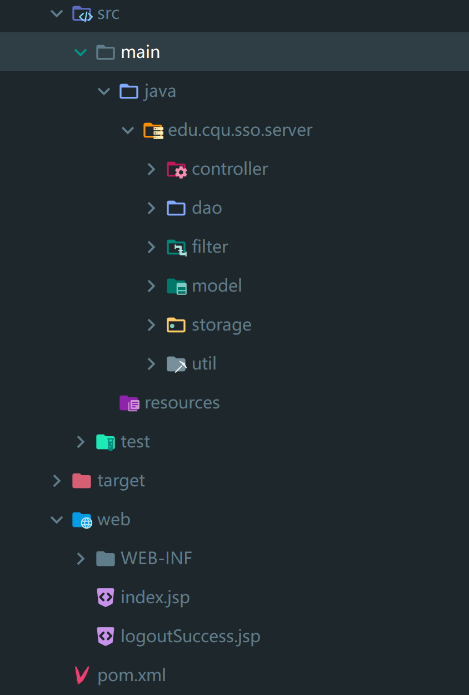

# 项目代码结构说明

1. 整个项目包括三个module（分别使用maven创建），分别是一个server，两个client。
2. 每个module都使用了mvc架构。

## server

文件树

### model

1. Class User 用户实体类，封装了username和password。
2. TicketGrangtingTicket 票根TGT类，封装了username，使用HaspMap实现的serviceMap。

### view

1. view层使用jsp实现。由于在本项目中，页面显示不是重点，故仅仅使用了index.jsp进行了简单的登录页实现。通过form表单，提交到项目的登录路由。
2. 位于web/WEB-INF中。

### controller

1. controller使用servlet实现，继承自HttpServlet。
2. LoginServlet，负责处理登录请求。
3. LogoutServlet，负责处理登出请求。
4. TicketServlet，负责处理Service Ticket的验证请求。

### filter

1. 使用了filter进行路由的过滤和拦截。filter拦截/下的所有路由，但是将login和logout路由放行，交由对应的controller处理。

### dao

1. dao层为数据库操作层，用于处理用户登录的验证。
2. BaseDao为dao类的基类，完成了数据库连接和配置等。
3. UserDao为User类的数据库操作类。

### storage

1. 定义了java的本地缓存类，使用HashMap实现。

### util

1. 抽象了常用的方法为工具类。包括重定向路由设置生成等。

## client

1. 两个应用系统客户端结构类似
2. 由于应用的场景较为简单，仅有一个user用户，而user用户实体类位于server端，因此，在client实际没有定义实体类model。
3. view使用jsp实现，包括homepage和logoutSuccess页面。
4. controller使用servlet实现，包括clientServlet处理主请求，logoutServlet处理登出请求。
5. filter对路由进行拦截，但是对login和logout相关请求放行，交由对应的controller处理。
6. storage定义了本地缓存类。

